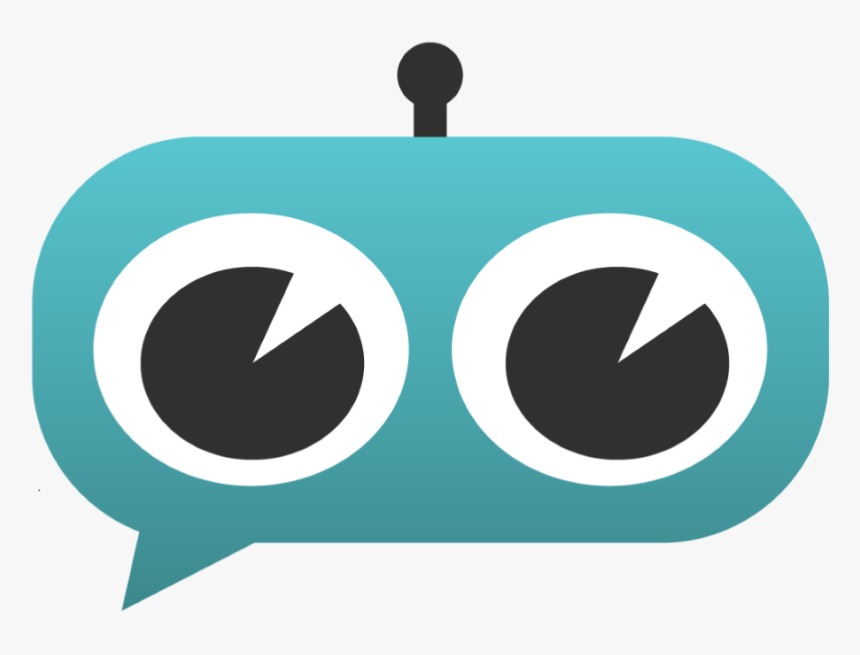

# CarlosAI  

### Objetivo  
Criar um agente de IA responsável por auxiliar usuários de sistema Windows.

### Funcionalidades  
- **Assistência com IA:** Interaja com um chatbot alimentado por um modelo de IA open-source.
- **Contexto dinâmico:** O chatbot permite salvar e limpar o contexto das conversas para melhor controle.
- **Gerenciamento de chat:** Possibilidade de limpar o histórico de conversas diretamente pela interface.
- **Interface gráfica amigável:** Utiliza uma interface moderna baseada na biblioteca `customtkinter`.
- **Execução em segundo plano:** A aplicação minimiza na bandeja do sistema, permitindo que continue rodando sem interrupções.
- **Notificações:** Recebe alertas enquanto a aplicação roda em segundo plano.

### Preparando o ambiente  
Execute o arquivo `build.bat` para configurar todo o ambiente.

### Executando a aplicação  
Execute o arquivo `run.bat` para iniciar a aplicação.

___

#### Experimento realizado em:
- Windows 11
- Python 3.11.9
- 13th Gen Intel(R) Core(TM) i7-13650HX
- NVIDIA RTX 4050 Laptop 6GB VRAM
- 16GB RAM

#### Agradecimento  
Inspirado no projeto [Vaibhavs10/llama-assistant](https://github.com/Vaibhavs10/llama-assistant)

#### Referências  
- [llama-cpp-python](https://github.com/abetlen/llama-cpp-python)

---

Essa estrutura torna mais fácil visualizar as funcionalidades e orienta o usuário no uso e preparação do projeto.